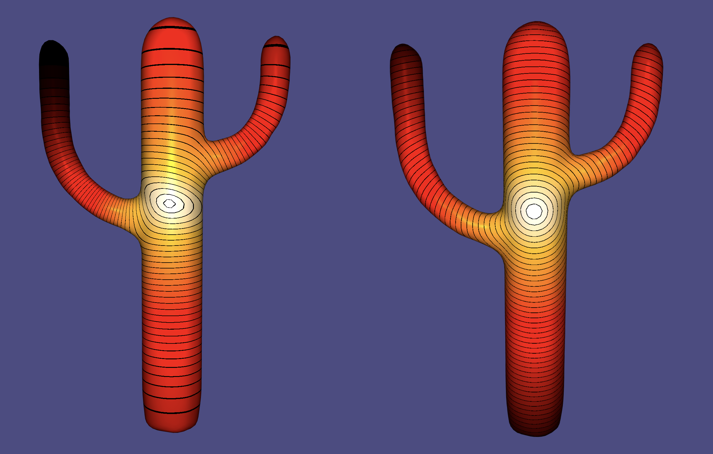
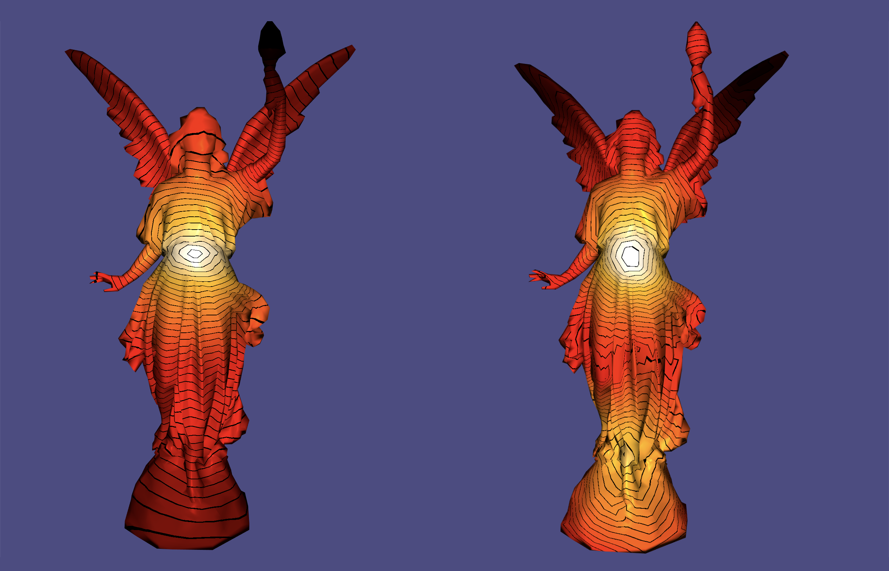

# Distance Between Two Points On 3D Surface
In computer graphics, there are many known algorithms for defining the *distance between two points on a 3D surface*. So far, the most popular distance definitions are the **Geodesic distance** and the **Diffusion distance**, however, each of them has its advantages and drawbacks.

In general, the quality of a distance definition is measured by fulfillment of the following 8 properties:

1. **metric**: non-negative, satisfies the identity of indiscernibles, symmetric, and satisfies the triangle inequality;
2. **smooth**: smooth with respect to perturbations of  and , with no singularities except derivative discontinuity at ;
3. **locally isotropic**: approximately geodesic when y is near ;
4. **globally "shape-aware"**: reflects the overall shape of the surface when  is far from ;
5. **isometry invariant**: does not change with isometric transformations of the surface; 
6. **insensitive to noise and topology**: does not change significantly with the addition of noise or changes to topology;
7. **practical to compute**: compute times between all pairs of points in common meshes take at most a few minutes; and
8. **parameter-free**: independent of any parameter that must be set differently for specific meshes or applications.

Unfortunately, none of the two popular methods satisfies all eight properties. But luckily, the **Biharmonic distance** was developed, which satisfies all eight properties.

|                                      | Geodesic distance | Diffusion distance | Biharmonic distance |
| ------------------------------------ | :---------------: | :----------------: | :-----------------: |
| 1) metric                            |         ✅         |         ✅          |          ✅          |
| 2) smooth                            |         ❌         |         ❌          |          ✅          |
| 3) locally isotropic                 |         ✅         |         ❓          |          ✅          |
| 4) globally "shape-aware"            |         ❌         |         ❓          |          ✅          |
| 5) isometry invariant                |         ✅         |         ✅          |          ✅          |
| 6) insensitive to noise and topology |         ❌         |         ✅          |          ✅          |
| 7) practical to compute              |         ✅         |         ✅          |          ✅          |
| 8) parameter-free                    |         ✅         |         ❌          |          ✅          |

✅ satisfied		❓not always satisfied		❌ not satisfied


### Biharmonic Distance

##### 1. Continuous definition

The **continuous biharmonic distance** is defined by 

<p align="center"></p>

where  and  are the eigenfunctions and eigenvalues (resp.) of the positive definite Laplace-Beltrami operator

<p align="center"></p>

with 


##### 2. Discrete definition

In the discrete case, the biharmonic distance is defined based on constructing a discrete Green’s function  of the Bi-Laplacian using the formula

<p align="center"></p>


Apply the common “cotangent formula” discretization of the Laplace-Beltrami differential operator on meshes, we get

<p align="center"></p>

where

* for a mesh function  with  vertices,  denotes its discrete Laplacian evaluated at vertex  (for )

*  is the Voronoi area at the  mesh vertex
*  are the two angles supporting the edge connecting vertices  and 

Let us denote the matrix of this linear transformation by .


Let  be the area/mass matrix of , which is a diagonal matrix with .

Let  be the conformal discrete Laplacian.

Then .

The discrete Green’s function of the Bi-Laplacian (i.e. ) can then be defined as the pseudo-inverse of .


Finally, the **discrete biharmonic distance** is defined by 

<p align="center"></p>


Libigl includes a wrapper for the discrete biharmonic distance developed by Yilin Qu ([https://github.com/YILINQ/biharmonic_distance/blob/master/src/biharmonic_distance.cpp](https://github.com/YILINQ/biharmonic_distance/blob/master/src/biharmonic_distance.cpp)), exposing it through an Eigen-based API. The function

```C++
igl::biharmonic_distance(V,F,D);
```

computes the discrete biharmonic distances between each pair of vertices in V.





[Example 001](https://github.com/YILINQ/biharmonic_distance/blob/master/main.cpp) allows to interactively pick the source vertex and displays the distance using a periodic color pattern. (left) Biharmonic distance, (right) Geodesic distance.


##### 3. Approximate discrete computation

Under the consideration of runtime, we may approximate  by computing

<p align="center"></p>

That is to compute the first  eigenvectors of the discrete Laplacian , which boils down to solving the generalized eigenvalue problem

<p align="center"></p>


Libigl includes a wrapper for the approximated discrete biharmonic distance, exposing it through an Eigen-based API. The function

```C++
igl::biharmonic_distance_approx(V,F,k,D);
```

computes the approximated discrete biharmonic distances between each pair of vertices in V, using the first  eigenvectors.


TODO: add image

Distance comparison between the exact approach (left) and the approximate approach (right).


TODO: update table

|                            | Exact | Approximate (with ) |
| -------------------------- | ----- | ------------------------------------------------------------ |
| cactus (with ??? vertices) | ???   | ???                                                          |
| lucy (with ??? vertices)   | ???   | ???                                                          |

Runtime comparison between the exact approach and the approximate approach.


### References

1. Y. Lipman, R. M. Rustamov, T. A. Funkhouser, [Biharmonic Distance](https://www.cs.princeton.edu/~funk/biharmonic.pdf), 2010.

